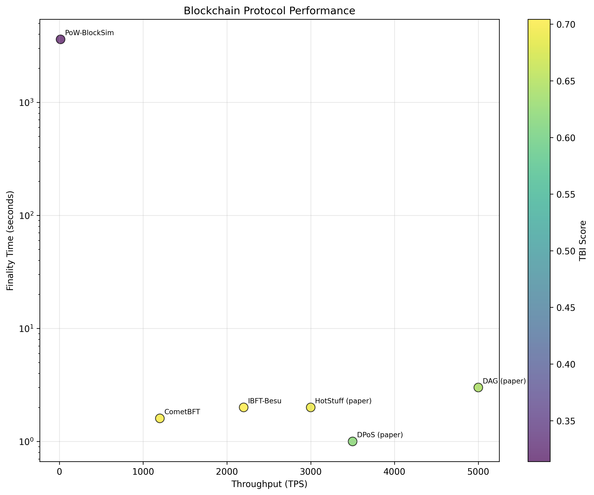

# TEF-2025 Analysis Report

*Generated: 2025-09-13 11:09:49*

Analyzed **6 blockchain protocols** using TEF-2025 framework.

## Top Performing Protocols (by TBI)

| Rank | Protocol | Family | TBI | Scalability | Security | Decentralization | Energy |
|------|----------|--------|-----|-------------|----------|------------------|--------|
| 1 | IBFT-Besu | PoA | 0.704 | 0.696 | 0.800 | 0.377 | 0.981 |
| 2 | CometBFT | BFT-PoS | 0.699 | 0.656 | 0.800 | 0.402 | 0.971 |
| 3 | HotStuff (paper) | BFT-PoS | 0.691 | 0.709 | 0.800 | 0.325 | 0.961 |
| 4 | DAG (paper) | DAG | 0.644 | 0.735 | 0.670 | 0.242 | 0.991 |
| 5 | DPoS (paper) | DPoS | 0.620 | 0.706 | 0.670 | 0.185 | 0.981 |
| 6 | PoW-BlockSim | PoW | 0.314 | 0.167 | 0.670 | 0.125 | 0.200 |

## Key Findings

- **Highest TBI**: IBFT-Besu (0.704)
- **Most Scalable**: DAG (paper) (0.735)
- **Most Secure**: CometBFT (0.800)
- **Most Decentralized**: CometBFT (0.402)
- **Most Energy Efficient**: DAG (paper) (0.991)

## Visualization

## Methodology

- **Framework**: TEF-2025 (Trilemma Evaluation Framework 2025)
- **Metrics**: Normalized to [0,1] using configured thresholds
- **TBI Weights**: Scalability (25%), Security (30%), Decentralization (25%), Energy (20%)
- **Data Sources**: Mix of local experiments and published results
